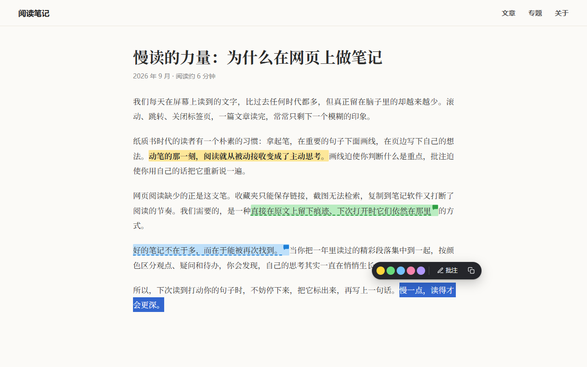
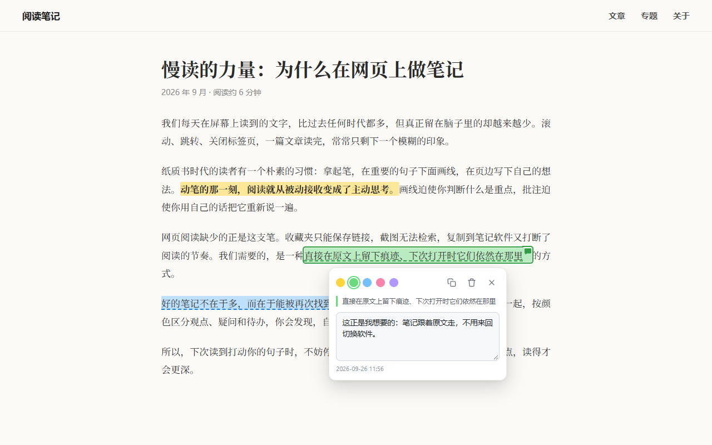
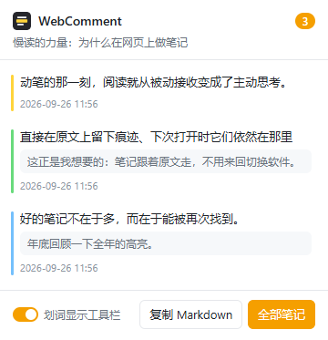
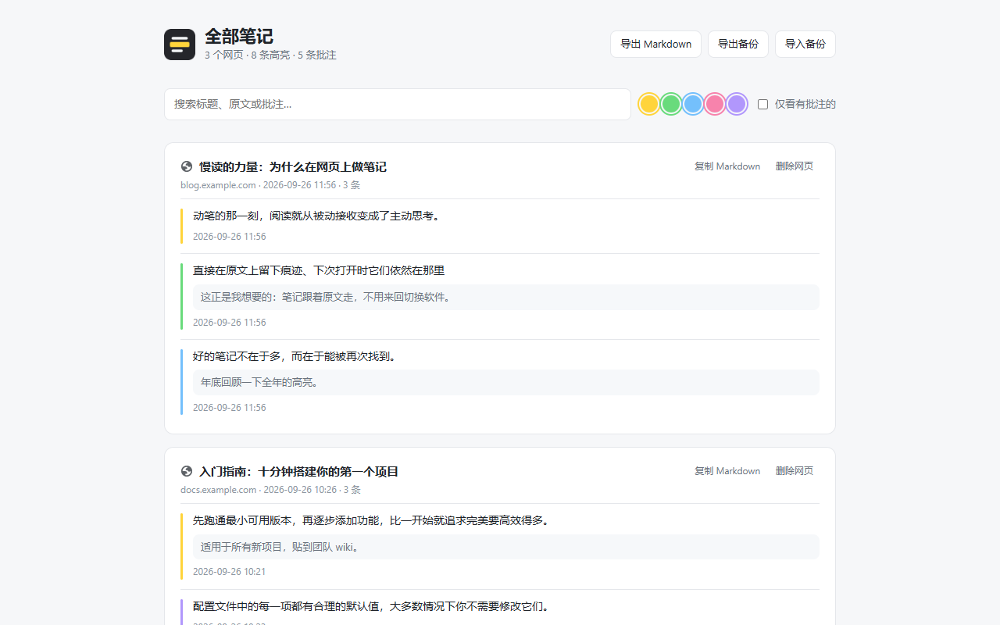

# WebComment 网页批注

在任意网页上高亮文字、写批注，下次打开同一网页时自动恢复。

Chrome / Edge 扩展（Manifest V3），纯原生 JavaScript，无依赖、无需构建；所有数据只保存在本地浏览器。



## 功能

- **划词高亮**：选中文字后点工具栏上的色块，5 种颜色，可以跨段落、列表和表格
- **批注**：点「批注」写下想法，边写边自动保存；有批注的高亮会显示虚线和小气泡
- **自动恢复**：再次打开网页时高亮和批注回到原位；网页改版、文字位置变化、延迟加载的内容、单页应用（SPA）切换路由都能处理
- **当前页笔记**：点扩展图标查看本页所有笔记，点击跳转到原文，一键复制为 Markdown
- **全部笔记**：汇总所有网页的笔记，支持搜索、按颜色筛选、编辑，导出 Markdown，备份 / 导入 JSON
- **快捷操作**：右键菜单，快捷键 `Alt+Shift+H` 高亮、`Alt+Shift+N` 批注

## 截图

点击高亮文字，可以换颜色、写批注、复制或删除：



<table>
  <tr>
    <td width="34%" valign="top"><p align="center">扩展弹窗：当前页笔记</p></td>
    <td width="66%" valign="top"><p align="center">全部笔记：搜索、筛选、导出</p></td>
  </tr>
</table>

## 安装

1. 到 [Releases](https://github.com/Felix-bin/WebComment/releases/latest) 下载最新的 `webcomment-x.y.z.zip`，解压到一个固定的文件夹（之后不要删除或移动它）
2. 打开 `chrome://extensions`（Edge 为 `edge://extensions`），打开右上角「开发者模式」
3. 点「加载已解压的扩展程序」，选择刚才解压出的文件夹

> 安装前已经打开的网页需要刷新一次才能使用。也可以直接克隆本仓库，加载仓库根目录。

**升级**：下载新版 zip，解压覆盖原文件夹，再到扩展页点一下 WebComment 卡片上的刷新按钮。笔记保存在浏览器里，不会因为升级丢失。

## 使用

- **高亮**：选中文字 → 点工具栏上的色块
- **批注**：选中文字 → 点「批注」，输入内容自动保存（`Ctrl+Enter` 完成）
- **编辑 / 删除**：点击已高亮的文字
- **右键菜单**：选中文字后右键「高亮选中文字」/「高亮并添加批注」；右键扩展图标可以打开「批注管理」
- **快捷键**：可以在 `chrome://extensions/shortcuts` 中修改

笔记只保存在当前浏览器中，不会在不同电脑之间同步。换电脑或重装浏览器前，请在「全部笔记」页面点「导出备份」，之后可以再「导入备份」。

## 隐私

不收集、不上传任何数据，没有统计和追踪代码，也不发起任何网络请求。详见 [PRIVACY.md](PRIVACY.md)。

## 实现要点

| 文件 | 作用 |
| --- | --- |
| `src/shared/core.js` | 存储（`chrome.storage.local`，按规范化 URL 分页存）、颜色、Markdown 导出 |
| `src/content/anchor.js` | 文本定位：把选区序列化为「全文偏移 + 原文 + 前后 32 字上下文」，恢复时按上下文打分匹配；空白变化时退回到折叠空白后的模糊匹配 |
| `src/content/highlighter.js` | 用 `<mark class="wcn-hl">` 包裹文本节点（可跨标签、跨段落） |
| `src/content/ui.js` | 划词工具栏、批注卡片，放在 closed Shadow DOM 中，不受网页 CSS / CSP 影响 |
| `src/content/content.js` | 主流程：创建、恢复、同步（多标签页 / 管理页的修改实时生效）、页面重渲染或懒加载内容出现后自动补挂、SPA 路由切换 |
| `src/background.js` | 右键菜单、快捷键、图标角标计数 |
| `src/popup/`、`src/manage/` | 弹窗与管理页 |

URL 规范化会去掉 `#锚点` 和 `utm_*`、`fbclid` 等跟踪参数；`#/`、`#!` 形式的前端路由会保留。

## 开发

```bash
node scripts/pack.js          # 打包：生成 dist/webcomment-<版本号>.zip（只含 manifest、icons、src）
node scripts/screenshots.js   # 重新生成 docs/images 下的截图（用无头 Chrome 加载真实扩展）
node scripts/make-icons.js    # 重新生成图标
node test/server.js           # 测试页：http://localhost:8765/test/
```

测试页带有 `chrome.*` 的模拟，可以在普通网页里直接运行内容脚本：刷新页面相当于「再次打开」，访问 `#shifted` 可以模拟网页改版（插入段落、空白变化）后的恢复。

发布新版本前先修改 `manifest.json` 里的 `version`。
